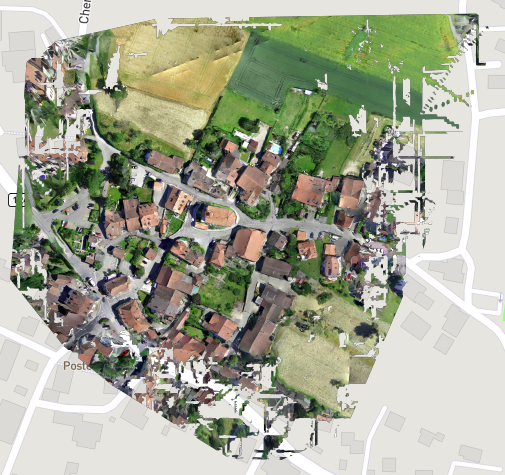

## Introduction
A drone survey refers to the use of a drone, or unmanned aerial vehicle (UAV), to capture aerial data with downward-facing sensors, such as RGB or multispectral cameras. During a drone survey with an RGB camera, a drone captures multiple images from multiple geo-coordinates at different angles. For a highly accurate aerial mapping mission, the drone is flown using an autopilot mission at a fixed height. This thesis proposes dedicated hardware, an autonomous unmanned aerial vehicle and software capable of generating orthomosaics, 3d models, digital surface models & digital terrain models.  Unlike manned aircraft or satellite imagery, drones can fly at a much lower altitude, making the generation of high-resolution, high-accuracy data, much faster, less expensive and independent of atmospheric conditions such as cloud cover. The work done in this thesis focuses on a military application of aerial mapping - Reconnaissance. Current methods of military reconnaissance is not safe as it involves sending personnel behind enemy lines to gather information. This can potentially lead to loss of life. The work adds support for two additional pipelines over aerial mapping, (1) face clustering & (2) weapon detection and recognition to accommodate for military reconnaissance requirements.

> Refer the thesis for more details : [https://drive.google.com/file/d/1XNqeSGF_V8w09IcIkT3gXfehL6w_Qvgp/view?usp=sharing](https://drive.google.com/file/d/1XNqeSGF_V8w09IcIkT3gXfehL6w_Qvgp/view?usp=sharing)

## Results
Lets look at the final result ;)

1. Sullens Dataset (Small town in Switzerland): The following reconstruction was completed using 37 RGB images. For more information regarding the results, kindly refer the project thesis (Available [here](https://drive.google.com/file/d/1XNqeSGF_V8w09IcIkT3gXfehL6w_Qvgp/view)).

<iframe allowfullscreen webkitallowfullscreen width="640" height="480" frameborder="0" seamless src="https://p3d.in/e/f484c+clean"></iframe>

2. Industrial Estate Dataset: (A small industrial estate in Switzerland). The following reconstruction was completed using 113 RGB images. More information on this available in the project thesis.

<iframe allowfullscreen webkitallowfullscreen width="640" height="480" frameborder="0" seamless src="https://p3d.in/e/FHZ4v+clean"></iframe>

The RGB files for the Sullens area is available on the SenseFly educational datasets page. The report shows the

Here's a preview of the mission cockpit for controlling & inspecting the autonomous flight.

<iframe width="560" height="315" src="https://www.youtube.com/embed/vSZF0FSfTHU" frameborder="0" allow="accelerometer; autoplay; clipboard-write; encrypted-media; gyroscope; picture-in-picture" allowfullscreen></iframe>

The basic goal of the project is mapping of a particular geological area. However, one of the applications of such a project heavily lies in the area of defence technologies, that is, on top of a full aerial map of the area, the pipeline is capable of face-recognition (for identifying key targets) and weapon recognition (upto 5 weapons at this stage). Here's a complete list of what the pipeline can produce.

1. Digital Surface Model

2. Digital Terrain Model

3. Orthophoto

4. 3D Textured Mesh

5. Measurement support

## The software

The project aims at providing a seamless interface for aerial mapping. A proper mission planning and execution web application has been implemented for the same.

1. Login Screen

2. Mission management: Existing missions

3. Mission management: New mission type

4. Mission setup: flight planner

5. Mission setup mission details

6. Mission setup: hardware selection

7. Mission cockpit: realtime drone status

8.  Mission viewer: DSM/DTM/Orthophoto viewer on map

9.  Mission viewer: 3D model viewer

## The hardware
Carrying out multiple tasks in real-time requires enormous amount of computing power. The project introduces several layers of hardware. The hardware requirements for the proposed pipeline can be categorized into three main types.

1. Vehicles
2. Controllers
3. Sensors

### Vehicles
The project proposes the use of a quad-copter running on auto-pilot to perform the information extraction procedure. The entire project setup will be present on a quad-copter. For powering the drone, four 930KV brush less DC motors have been used (2 clockwise, and 2 anti-clockwise) along with 9" propellers. A few technical specifications with respect to the functioning of the quad copter are as follows.

#### Communication Systems
1. FS-iA6B 2.4Ghz communication link : The FS-iA6B serves as the main link between the PixHawk 2.4.8 Flight controller and a control remote dedicated to the quad copter. The specified range for this module is up to 1km.
2. 433Mhz secondary telemetry module : The secondary telemetry serves as a failsafe communication link in case the primary 2.4Ghz link is lost. This telemetry link also provides support for in-flight logging and diagnostics. Additionally, the secondary telemetry link is used for uploading mission flight plans on-to the flight controller.
3. Wifi @ 2.4 Ghz : An additional WiFi module aids the commmunication between the Jetson Nano Developer Kit and the host computer. This link is useful for diagnosing any issues with 3D scene reconstruction, weapon recognition or face recognition.

#### Power Control & Distribution
To power the motors, four 30A Electronic Speed Controllers are used. The quadcopter makes use of a printed Power Distribution Board (PDB) for distribution of power to each motor. The in-flight stabilization and radio control is provided by the on-board PixHawk 2.4.8 flight controller. An APM module has been used for distributing power from battery to motors and the flight controller.

#### Controllers
The controllers are responsible for all the computing processes on board. The project makes use of two controllers, working together in order to achieve the goal. One of the controllers (Jetson Nano) is responsible for running 3D reconstruction, weapon recognition and face recognition, while the other controller (PixHawk 2.4.8) is used for stabilizing and flying the UAV in autonomous mode.

1. Jetson Nano : The Jetson Nano developer kit is a small, powerful computer that lets us run multiple deep learning networks in parallel. The Jetson Nano development board used for performing 3D reconstruction, Weapon Recognition as well as Face Recognition.

2. PixHawk 2.4.8 : Quadcopters are mechanically simple. By controlling the speeds of the four propellers, the quad-copters can roll, pitch, yaw and accelerate along the common orientation. Quad-copters are extremely agile, but the agility comes at a cost - quad-copters are inherently unstable, and require automatic feedback control in order to be able to fly. The PixHawk 2.4.8 provides estimation and control algorithms for the quad-copter to maintain stable flight.

### Sensors
The proposed system requires multiple sensors in order to capture crucial information and maintain stable flight throughout the operation.

1. Global Positioning System :  A GPS module measures your drones location by measuring how long a signal takes to travel from a satellite. A GPS Module is also able to give an estimation of your drones altitude. However, GPS models are rather inaccurate and will only give you an accurate position within 5m. However by combining measurements from other sensors the flight controller can get a better picture of what the drone is doing. The main feature used by the GPS module is that you can autonomously fly your drone to way-points, so your drone can potentially fly on its own from takeoff to landing.

2. HD Webcam: for capturing photographs.

Refer the thesis for more details : [https://drive.google.com/file/d/1XNqeSGF_V8w09IcIkT3gXfehL6w_Qvgp/view?usp=sharing](https://drive.google.com/file/d/1XNqeSGF_V8w09IcIkT3gXfehL6w_Qvgp/view?usp=sharing)